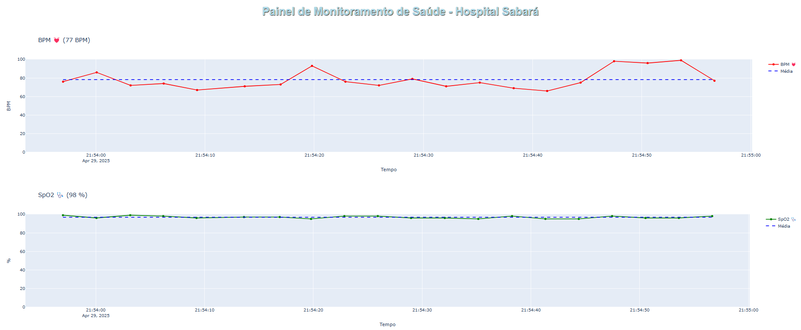
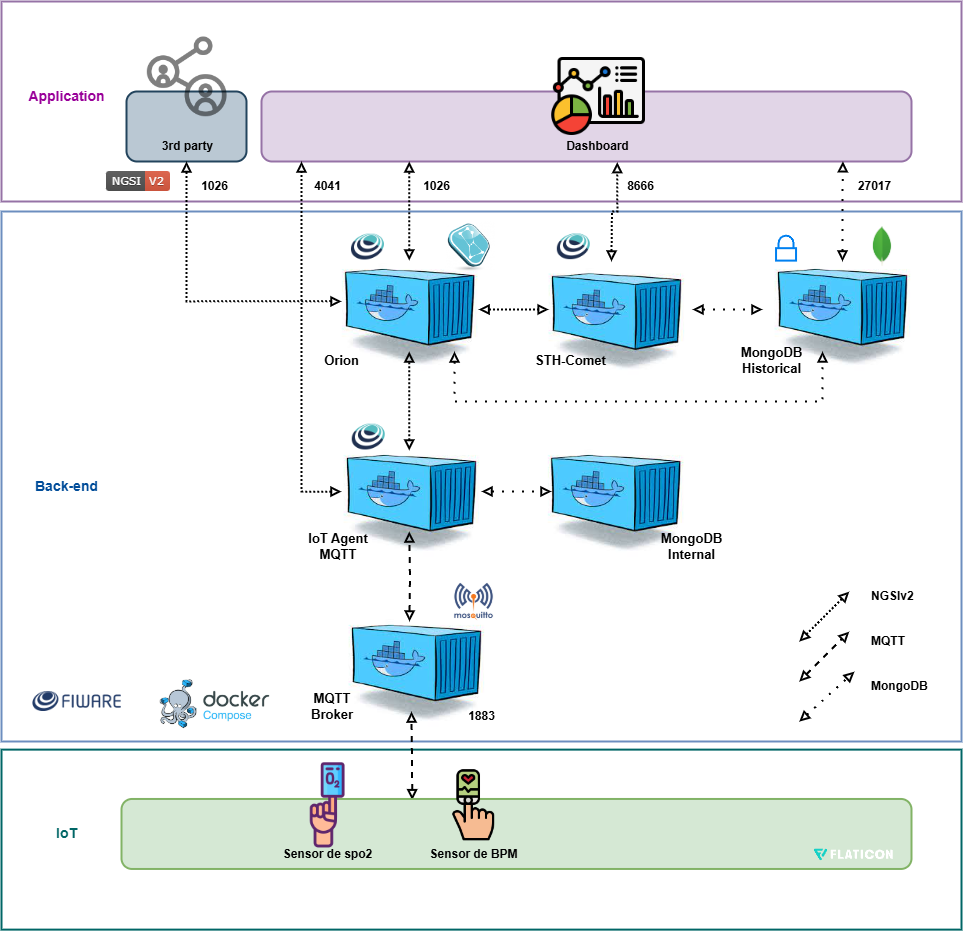

# 🎵 Projeto Mini Piano Sensorial – Hospital Sabará

> **Turma:** 1ESPA  
> **Integrantes:**  
> - Kauã Rodrigues  
> - Felipe Marceli  
> - Gustavo Naoto  

---

## 🧠 Descrição do Projeto

Este projeto foi desenvolvido para o Hospital Sabará com o objetivo de entreter e acalmar crianças com deficiência auditiva durante a coleta de dados biométricos (oxigenação do sangue e temperatura corporal). Ele integra um mini piano com feedback visual (LEDs) e sonoro (notas musicais) enquanto monitora os sinais vitais da criança e envia os dados para um dashboard em tempo real.

- Cada botão do piano toca uma nota musical e acende um LED correspondente ao ser pressionado.
- O sistema foi pensado especialmente para crianças com deficiência auditiva, utilizando estímulos visuais como forma alternativa de engajamento.
- Enquanto a criança interage com o piano, sensores coletam os dados de **Temperatura corporal (Temp)** e **batimentos cardíacos (BPM)**.
- As informações são transmitidas para um **dashboard interativo** hospedado em uma **máquina virtual Linux (Ubuntu)** na plataforma **Microsoft Azure**.

---

## 📊 Diagrama do Sistema

> 

---

## 🔧 Tecnologias Utilizadas

- **ESP32**
- **SENSOR MAX30102 (BPM E TEMPERATURA)**
- **Display I2C** 
- **Buzzer**
- **Botões com LEDs**
- **FIWARE / MQTT**
- **Dashboard (Plotly / Web app personalizado)**
- **Azure VM (Linux Ubuntu)**

---

## 🔗 Links Importantes

- 🎥 **Vídeo Demonstrativo (YouTube):** https://youtu.be/c8mZYfiCvTE
- 🧪 **Simulação (Wokwi):** https://wokwi.com/projects/433327820734873601
- 💻 **Código-fonte (GitHub):** https://github.com/kauarodrigues1/PrototipoChallenge

---

## 💡 Futuras Melhorias

- Sensor de batimentos cardíacos e temperatura. (FEITO)
- Integração com gamificação ou minigames sensoriais.
- Compatibilidade com outros sensores biométricos. (FEITO)
- Implementação de uma bateria
- Alerta de bpm ou temperatura crítica 

---

> Projeto desenvolvido com foco em **tecnologia assistiva** e **humanização no ambiente hospitalar infantil**. 💙
